# Communication et suivi de tâches avec Trello

L'outil de communication principal au laboratoire est [Trello](https://trello.com).

Trello est un outil à la fois très simple et très versatile. Il peut être utilisé de 1000 façons, alors assurez-vous de bien lire comment nous nous en servons au labo.

<!-- TOC depthFrom:2 depthTo:6 withLinks:1 updateOnSave:1 orderedList:0 -->

- [À votre arrivée au laboratoire](#-votre-arrive-au-laboratoire)
- [Description des boards](#description-des-boards)
	- [Board du laboratoire](#board-du-laboratoire)
	- [Board d'étudiant](#board-dtudiant)
	- [Board(s) de projet](#boards-de-projet)
- [Types de carte](#types-de-carte)
	- [Information](#information)
		- [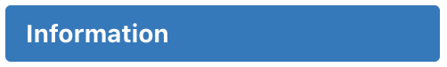](#img-srctagstaginformationpng-altinformation-width200px)
	- [Discussion](#discussion)
		- [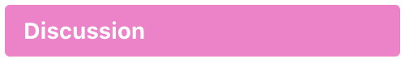](#img-srctagstagdiscussionpng-altdiscussion-width200px)
	- [Tâche](#tche)
		- [États](#tats)
			- 
			- [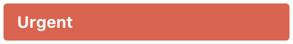](#img-srctagstagurgentpng-alturgent-width200px)
			- [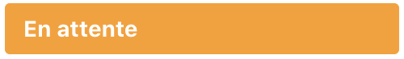](#img-srctagstagenattentepng-alten-attente-width200px)
			- [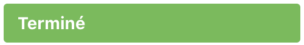](#img-srctagstagterminepng-alttermin-width200px)
		- [Assignation](#assignation)
		- [Workflow de suivi de tâche](#workflow-de-suivi-de-tche)

<!-- /TOC -->

## À votre arrivée au laboratoire

Comme pratiquement toutes les communications écrites passent par Trello, il est important de bien réaliser ces deux étapes pour ne rien manquer:

1. Se logger sur [Trello](https://trello.com). Vous pouvez vous logger directement avec votre adresse email de l'UQAM sans avoir à créer un nouveau compte.

2. S'assurer de recevoir des courriels de notification de Trello, pour être avertis lorsque vous êtes taggé(e)s ou assigné(e)s. Choisir "Periodically" ou "Instantly" selon votre préférence :

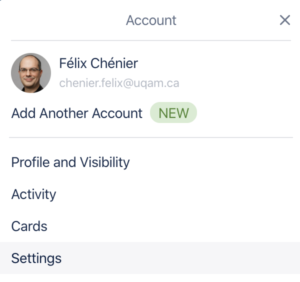
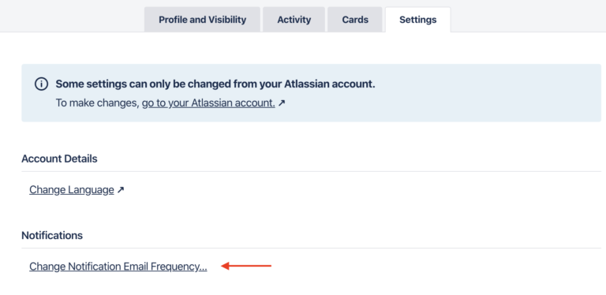

3. Pour être certain de ne rien manquer sur un board, même si la personne qui vous mentionne oublie de vous tagger, vous pouvez également suivre un board. Ainsi, tout changement sur le board vous sera indiqué par courriel (attention au possible gros volume de courriel) :

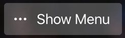
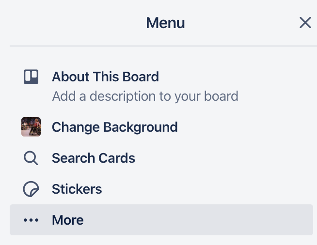
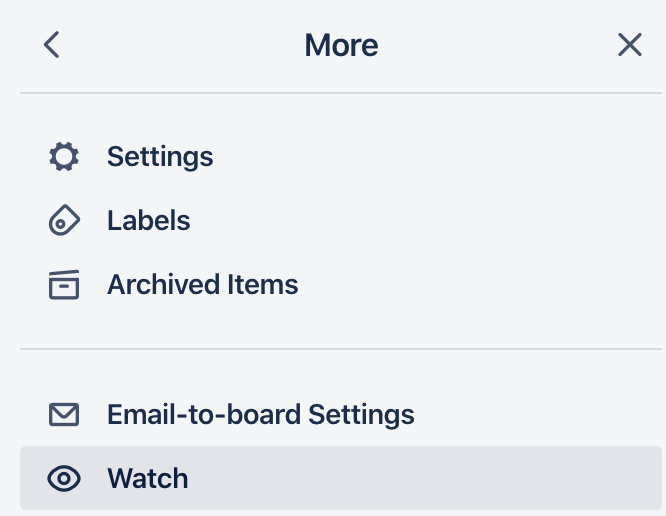

## Description des boards

Afin de faciliter le suivi des projets des étudiant(e)s, chaque étudiant(e) est généralement ajouté à 3 boards:

### Board du laboratoire

Le [board du laboratoire](https://trello.com/b/svo4meRP/) est partagé avec tous les membres du labo. Il comporte entre autres les ressources et procédures au laboratoire, des canaux de discussion (e.g., annonces, discussions sur les rencontres de laboratoire, etc.).

### Board d'étudiant

Ce board est dédié à la progression de l'étudiant(e) dans son stage/maîtrise/doctorat, et est partagé seulement avec moi. Il traite de choix de cours, de rédaction de mémoire et de thèse, d'immigration pour les étudiants étrangers, etc.

### Board(s) de projet

Les boards de projet sont utilisés pour suivre les avancements de projets, et sont partagés avec tous ceux qui travaillent sur ce projet.

## Types de carte

Nous utilisons trois types de cartes:

- Information
- Discussion
- Tâche (le type le plus courant)

Ces types sont déterminés à l'aide du tag qui leur est attribué. Si vous ne voyez pas le nom du tag:

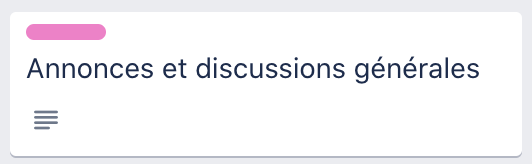

vous pouvez cliquer sur le rectangle de couleur pour que toutes les cartes affichent maintenant le nom des tags:

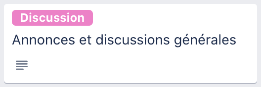

### Information

#### 

Ce type de carte est utilisé pour partager visiblement et indéfiniment une information utile aux usagers du board. Par exemple :

- Sur le board du laboratoire:
    - l'adresse Zoom pour les rencontres de laboratoire en virtuel
    - les liens vers les procédures (e.g., le fichier que vous lisez actuellement)
    - etc.
- Sur un board de projet:
    - une datasheet
    - une spécification technique
    - une liste d'adresses courriel de collaborateurs
    - etc.

Ces cartes fournissent de l'information, pas des données. Pour partager des données, on doit plutôt utiliser un dossier partagé (Dropbox) ou un repository (github). Une carte d'information est alors un moyen utile pour partager l'adresse d'un tel dossier ou repository.

### Discussion

#### 

Ce type de carte jour le rôle de "canal de discussion" tel qu'on retrouverait sur Microsoft Teams, Slack, etc. C'est un bon moyen de joindre des membres du laboratoire et d'avoir des discussions autour d'un sujet général qui ne sont pas nécessairement liées à des tâches. Par exemple :

- Sur le board du laboratoire:
    - Annonces et discussions générales
    - Discussions et planification des rencontres de laboratoire
    - Congrès et événements
    - Activités sociales
    - etc.

Il est souhaitable de se tagger afin d'être notifiés par courriel ou via l'[application de bureau Trello](https://trello.com/platforms):

- Pour écrire spécifiquement à quelqu'un (et le notifier), utiliser **@*nom_de_l_utilisateur***.
- Pour écrire à tous les gens du board (et les notifier), utiliser **@board**.

### Tâche

Ce type de carte est le plus commun sur les boards d'étudiant et de projets, et c'est la raison principale pourquoi on utilise Trello. Chaque tâche à faire comporte à la fois un état et une personne assignée.

#### États

##### 

La tâche est activement en cours de traitement par la personne assignée.

##### 

La tâche est urgente et est en traitement par la personne assignée.

##### 

La tâche est en attente de quelque chose. Pour ces cartes:

- Mentionner après quoi on attend dans les commentaires de la carte.
- Si on attend après la complétion d'une autre tâche, alors il est intéressant de mettre un lien vers l'autre carte, également dans les commentaires de la carte.

##### 

La tâche est terminée.

Généralement, il est préférable d'utiliser ce label plutôt que d'archiver la carte. Lorsque toutes les tâches d'une liste sont terminées, on archive plutôt la liste elle-même. Ceci garde une meilleure trace de l'avancement des tâches d’une liste.

Également, pour consultation future, il est généralement plus facile et pratique de désarchiver une liste plutôt que de faire des recherches parmi des cartes archivées.

Ceci dit, il est également inutile de garder la trace d'une tâche très simple, qui ne comporte aucune pièce jointe, et qui contribue alors simplement à polluer le board. Le bon jugement est conseillé.

#### Assignation

Les cartes de type tâche doivent être "réalisées", et ceci par une personne. Pour faire le suivi de qui travaille sur chaque tâche, on doit assigner une personne à la tâche. Généralement, il est plus productif d'assigner une seule personne à la tâche; celle-ci devient alors la personne responsable de l'avancement.

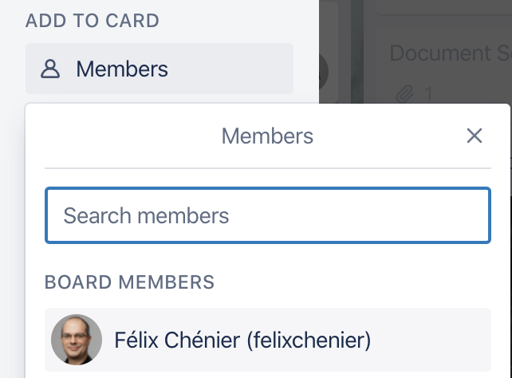

Il est possible de consulter, d'un seul regard, toutes les tâches qui vous sont assignées, en cliquant sur votre icône en haut à droite et en choisissant "Cards".

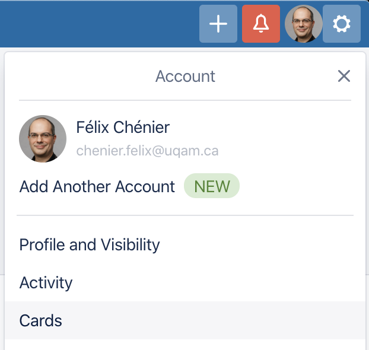

#### Workflow de suivi de tâche

Voici un exemple de workflow générique à adopter pour s'assurer qu'une tâche ne parte pas dans l'oubli et que son suivi soit optimal. Il ne comporte pas tous les cas de figure, mais est pas mal complet.

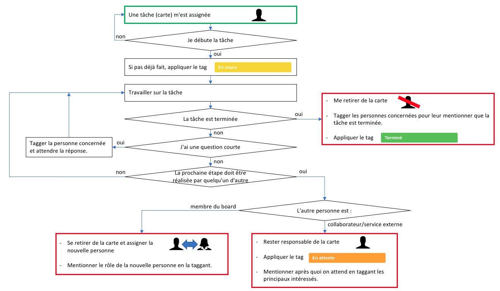
